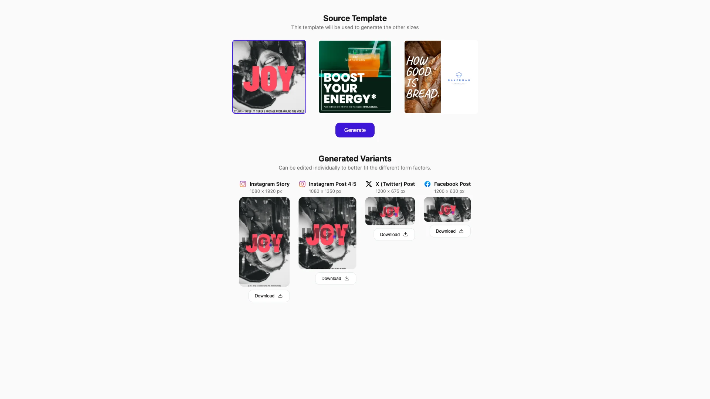

# Automated Resizing Starter Kit (React)

Create designs once and automatically resize them to multiple social media formats using AI-powered content-aware resizing. Built with [CE.SDK](https://img.ly/creative-sdk) and React by [IMG.LY](https://img.ly), runs entirely in the browser with no server dependencies.

<p>
  <a href="https://img.ly/docs/cesdk/starterkits/auto-resize/">Documentation</a> |
  <a href="https://img.ly/showcases/cesdk">Live Demo</a>
</p>



## Getting Started

### Clone the Repository

```bash
git clone https://github.com/imgly/starterkit-automated-resizing-react-web.git
cd starterkit-automated-resizing-react-web
```

### Install Dependencies

```bash
npm install
```

### Download Assets

CE.SDK requires engine assets (fonts, icons, UI elements) served from your `public/` directory.

```bash
curl -O https://cdn.img.ly/packages/imgly/cesdk-js/$UBQ_VERSION$/imgly-assets.zip
unzip imgly-assets.zip -d public/
rm imgly-assets.zip
```

### Run the Development Server

```bash
npm run dev
```

Open `http://localhost:5173` in your browser.

## How It Works

1. **Select a template** – Choose from pre-designed templates or edit your own
2. **Click "Generate"** – The starterkit generates resized versions for all social media platforms
3. **Review and download** – Preview each variant, edit if needed, and download

## Content-Aware Resizing

CE.SDK's content-aware resizing algorithm intelligently adapts your design to different aspect ratios:

```tsx
import { resize, DEFAULT_SIZES } from './imgly';

// Generate variants for all default social media sizes
const results = await resize({
  engine: cesdk.engine,
  sizes: DEFAULT_SIZES,
  sceneUrl: templateUrl,
  onProgress: (completed, total, variant) => {
    console.log(`Generated ${completed}/${total}: ${variant.size.label}`);
  }
});

// Each result contains:
// - size: The target dimensions
// - blob: Exported image as Blob
// - sceneString: Scene JSON for further editing
```

### Supported Sizes

| Platform    | Format    | Dimensions  |
| ----------- | --------- | ----------- |
| Instagram   | Story     | 1080 × 1920 |
| Instagram   | Post 4:5  | 1080 × 1350 |
| Instagram   | Square    | 1080 × 1080 |
| Instagram   | Landscape | 1080 × 566  |
| X (Twitter) | Post      | 1200 × 675  |
| X (Twitter) | Header    | 1500 × 500  |
| Facebook    | Post      | 1200 × 630  |
| Facebook    | Cover     | 820 × 312   |
| Facebook    | Story     | 1080 × 1920 |
| LinkedIn    | Post      | 1200 × 627  |
| LinkedIn    | Cover     | 1584 × 396  |
| YouTube     | Thumbnail | 1280 × 720  |
| YouTube     | Banner    | 2560 × 1440 |

### Custom Sizes

```tsx
import { resize, type SizePreset } from './imgly';

const customSizes: SizePreset[] = [
  {
    id: 'custom-banner',
    label: 'Website Banner',
    width: 1920,
    height: 400,
    designUnit: 'Pixel',
    platform: 'custom'
  }
];

const results = await resize({
  engine: cesdk.engine,
  sizes: customSizes,
  sceneUrl: templateUrl
});
```

## Architecture

```
starterkit-automated-resizing-react-web/
├── src/
│   ├── index.tsx                 # React entry point
│   ├── app/
│   │   ├── App.tsx               # Main app component (orchestrator)
│   │   ├── App.module.css        # App styles
│   │   ├── hooks.ts              # Custom React hooks
│   │   ├── TemplateSection/      # Template selection UI
│   │   ├── TemplateCard/         # Individual template card
│   │   ├── VariantsSection/      # Generated variants display
│   │   ├── VariantCard/          # Individual variant card
│   │   ├── EditorModal/          # CE.SDK editor modal
│   │   ├── EditOverlay/          # Edit button overlay
│   │   └── Spinner/              # Loading spinner
│   └── imgly/
│       ├── index.ts              # Public API exports
│       ├── types.ts              # TypeScript type definitions
│       ├── sizes.ts              # Social media size presets
│       ├── templates.ts          # Template definitions
│       ├── resizing.ts           # Content-aware resizing logic
│       ├── utils.ts              # Utility functions
│       └── config/               # CE.SDK configuration
│           ├── plugin.ts         # Main plugin orchestration
│           ├── actions.ts        # Load, Save, Export actions
│           ├── features.ts       # Feature toggles
│           ├── settings.ts       # Engine behavior
│           ├── i18n.ts           # Internationalization
│           └── ui/               # UI layout configuration
├── public/                       # Static assets
├── package.json
└── vite.config.ts
```

## React Components

The starterkit uses a component-based architecture with custom hooks for state management:

```tsx
// App.tsx - Thin orchestrator using custom hooks
export default function App() {
  const engine = useEngine();           // CE.SDK engine management
  const templates = useTemplates();     // Template state
  const modal = useEditorModal();       // Modal state
  const variants = useVariants(engine.cesdk, engine.isReady);

  return (
    <div className={styles.app}>
      <CreativeEditor config={config} init={engine.handleInit} />
      <TemplateSection {...} />
      <VariantsSection {...} />
      <EditorModal {...} />
    </div>
  );
}
```

## Key Capabilities

- **Content-Aware Resizing** – AI-powered resizing that maintains design integrity
- **Social Media Presets** – Pre-configured sizes for Instagram, X, Facebook, LinkedIn, YouTube
- **Batch Generation** – Generate all variants from a single source with one click
- **Individual Editing** – Fine-tune each variant separately with full CE.SDK editor
- **Multi-Format Export** – PNG, JPEG, WebP with quality controls
- **React Integration** – Uses `@cesdk/cesdk-js/react` wrapper and custom hooks

## Prerequisites

- **Node.js v20+** with npm – [Download](https://nodejs.org/)
- **Supported browsers** – Chrome 114+, Edge 114+, Firefox 115+, Safari 15.6+

## Troubleshooting

| Issue               | Solution                                           |
| ------------------- | -------------------------------------------------- |
| Editor doesn't load | Verify assets are accessible at `baseURL`          |
| Resizing fails      | Ensure scene has at least one page                 |
| Watermark appears   | Add your license key                               |
| Variants look wrong | Check source design has proper element positioning |

## Documentation

For complete integration guides and API reference, visit the [Automated Resizing Documentation](https://img.ly/docs/cesdk/starterkits/auto-resize/).

## License

This project is licensed under the MIT License - see the [LICENSE](LICENSE) file for details.

---

<p align="center">Built with <a href="https://img.ly/creative-sdk?utm_source=github&utm_medium=project&utm_campaign=starterkit-automated-resizing">CE.SDK</a> and React by <a href="https://img.ly?utm_source=github&utm_medium=project&utm_campaign=starterkit-automated-resizing">IMG.LY</a></p>
